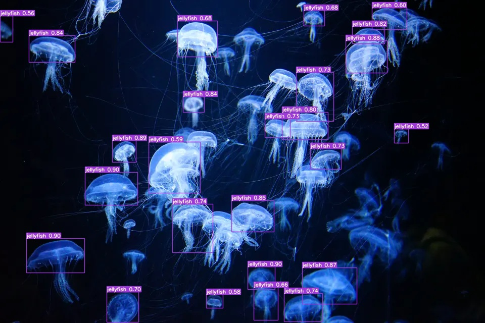

# StudyGroup Lab5

In this lab, I simplified the [YOLOv7](https://github.com/WongKinYiu/yolov7) by modifying the [train.py](./train.py) and [detect.py](./detect.py) scripts.  
The outcomes are represented in [train.ipynb](./train.ipynb) and [inference.ipynb](./inference.ipynb).

Additionally, I applied transfer learning to fine-tuning the YOLOv7 model to the [Aquarium Dataset](https://public.roboflow.com/object-detection/aquarium).

## Results

    

